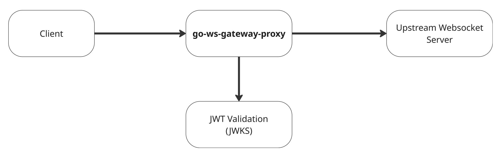
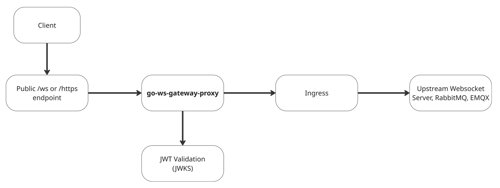

# go-ws-gateway-proxy

A high-performance, secure, and protocol aware WebSocket gateway designed to handle thousands of concurrent connections, whether MQTT-over-WebSocket or raw WebSocket in a unified, observable, and production ready manner.

---

## 🚀 Why This Project Exists

Modern real-time systems demand scalable gateways to ingest connections from heterogeneous clients: robots, IoT devices, mobile apps, telemetry dashboards, and more. These clients often use:

- MQTT-over-WebSocket (for sensor data, telemetry, robotics)
- Raw WebSocket (for JSON RPC, custom protocols, command channels)

While WebSocket is a great transport for bidirectional communication, **many WebSocket backends (like RabbitMQ, EMQX, or internal services) do not provide native authentication or authorization**. This project introduces a secure **middle-layer proxy** that provides:

- **JWT-based authentication** on every incoming connection
- **Protocol detection and dispatching**
- **Observability and metrics**
- **Deployment simplicity behind ingress gateways like Traefik or NGINX**

**Why JWT?**

- Because it's interoperable with any **OIDC-compliant identity provider** (like Keycloak, Auth0, AWS Cognito, Azure AD)
- JWTs can be **embedded in MQTT CONNECT packets**, used as initial messages, sent in headers, or attached a (http-only) session cookie
- This allows the gateway to be a proper **security enforcement boundary**, even when the backend lacks native identity controls

**This project is that gateway.**

Written in Go for performance and concurrency, it uses:

- `gorilla/websocket` for low-level WebSocket control
- `golang-jwt/jwt/v5` for standards-compliant JWT verification
- Prometheus metrics for real-time observability

---

## 🧠 Design Goals

- ⚡ **Minimal latency**
- 🧵 **Two goroutines per connection** (no context switching)
- 🔐 **JWT-secured access**
- 🔁 **Full-duplex binary & text stream support**
- 🧩 **Multi-protocol support** (MQTT/WS, raw WS, future protocols)
- 📊 **Observability-first** with labeled Prometheus metrics
- 🚦 **Graceful shutdown** for container orchestration
- ☁️ **Cloud-native by default** (Kubernetes, Traefik, Docker)

---

## 🔧 Architecture

### 1. Direct WebSocket Gateway Model

This shows how a client connects directly to the `go-ws-gateway-proxy`, which validates JWTs and forwards traffic to the backend.



### 2. Full Deployment with Traefik + Ingress

This shows how the proxy can sit behind a public L4/L7 ingress (e.g., Traefik) and route traffic securely within Kubernetes or a VM-based infrastructure.



---

## 🧰 Features

### ✅ Unified Entry Point

Single endpoint (`/ws`) supports both:

- MQTT-over-WebSocket (e.g., RabbitMQ w/ MQTT-WS plugin)
- EMQX
- Mosquitto with WebSocket bridge
- Raw WebSocket clients (e.g., control channels, JSON-RPC, custom frames)

### ✅ Intelligent Protocol Discovery

The gateway uses a lightweight parser to autodetect the protocol:

```go
protocol, username, token, err := ParseConnect(packet)
```

### 🛡️ Secure JWT Validation

- JWTs extracted from MQTT `password`, raw WS payload, headers, or (http-only) session cookie
- Validated using JWKS from any OIDC-compliant provider
- Claims parsed: `sub`, `preferred_username`, `iat`, `exp`, `jti`

This creates a **security envelope** on top of the WebSocket protocol, even when the downstream WebSocket service lacks native identity enforcement.

### 🔐 JWT Caching & Replay Protection

The gateway supports token caching to avoid repeatedly verifying JWT signatures and to prepare for features like token revocation and replay detection.

- **Supported cache backends**:

  - `memory` (default, per-pod, ephemeral)
  - `redis` (shared across replicas)
  - `postgres` (persistent, optionally shared)

- **Configuration:**

  - `JWT_CACHE_STORE`: `memory` | `redis` | `postgres`
  - `JWT_CACHE_PREFIX`: Optional prefix to namespace cache keys (default: `jwt_cached_token_`)
  - `REDIS_URL`: Required when using Redis backend
  - `POSTGRES_DSN`: Required when using Postgres backend

- **Behavior:**
  - Valid JWTs (based on `sub`, `jti`, `exp`) are cached
  - Prevents repeated re-verification of the same token
  - Prepares groundwork for support of:
    - Token revocation lists (via `jti`)
    - Replay detection across IPs/devices
    - Real-time token invalidation

Fallback to in-memory cache occurs automatically if misconfiguration is detected or external stores are unavailable.

#### 🔐 Token Revocation & Replay Response (Experimental)

The gateway now includes early-stage support for distributed token revocation and eviction. This is useful for:

- Forcing logout or session termination across connected clients
- Coordinating global revocation across pods using Redis Pub/Sub
- Clearing `jti` entries from the in-memory or external token cache (Redis/Postgres)

### ✅ Capabilities

- `POST /admin/revoke`: Revoke a specific token using its `sub` and `jti` claims.
- Revocation removes the token from the active cache backend (in-memory, Redis, or Postgres).
- Revocation also publishes a **"poison pill"** via Redis to notify all proxy pods.
- Any active WebSocket connection using that token will be closed with a `1008` frame.

### 🔁 Current Limitations

- Replay protection is still **best-effort**—only sessions that respect `sub:jti` cache keys are affected.
- Clients using the same token across connections may still connect briefly before the revocation is received.
- A background job or expiration TTL is still needed for Postgres cache cleanup (see TODO).
- Intended to run behind a service mesh, reverse proxy, or internal firewall, no protection on this exposed route.

### Example Revocation Request

```bash
curl -X POST http://<gateway-host>/admin/revoke \
  -H "Content-Type: application/json" \
  -d '{ "sub": "user123", "jti": "abcde-uuid-123" }'
```

### ✅ Transparent Proxying

- Zero-copy WebSocket forwarding
- No payload parsing or transformation
- Binary or text preserved
- Keeps native framing (e.g., MQTT control packets)

### ✅ Rate Limiting

The gateway supports **optional message-level rate limiting** on all active WebSocket connections. This protects against abusive clients, ensures system fairness, and enforces resource boundaries.

- **Configuration:**

  - `RATE_LIMIT_PER_SECOND`: Maximum sustained message rate (refill rate of the token bucket)
  - `RATE_LIMIT_BURST`: Maximum burst capacity (number of messages allowed in a short burst)

- **Behavior:**

  - Enforced using Go’s token bucket algorithm (`golang.org/x/time/rate`)
  - On violation, the gateway sends a standards-compliant control frame:
    ```http
    WebSocket Close Code: 1008 (Policy Violation)
    Reason: Rate limit exceeded
    ```
  - The connection is then closed gracefully

- **Identity-aware enforcement:**

  - For authenticated clients, rate limits are enforced **per JWT subject (`sub`)**
  - For anonymous clients, fallback to **IP address-based limiting**
  - Ensures shared rate control across all concurrent sessions from the same user or client

- **Distributed enforcement via Redis:**
  - When `REDIS_URL` is set, rate limits are enforced across instances using a Redis-backed counter (with 1-second fixed windows)
  - Lua scripting ensures atomicity and correct TTL behavior under load
  - Fallbacks to in-memory limits if Redis is unavailable

### 📈 Prometheus Metrics

| Metric                                          | Description                                                    |
| ----------------------------------------------- | -------------------------------------------------------------- |
| `ws_connections_total`                          | Total number of WebSocket connections attempted                |
| `ws_auth_failures_total`                        | Count of invalid, expired, or malformed JWTs                   |
| `ws_auth_success_total{sub,preferred_username}` | Successful JWT authentications labeled by subject and username |
| `ws_active_sessions`                            | Currently active WebSocket proxy sessions                      |
| `ws_connection_duration_seconds`                | Histogram of WebSocket session lifetimes (seconds)             |
| `ws_protocol_connections_total{protocol}`       | Total connection count by protocol type (`mqtt`, `raw`, etc.)  |
| `ws_proxy_errors_total{protocol}`               | Total proxy-level failures during streaming                    |
| `ws_proxy_retries_total{protocol}`              | Count of upstream reconnect attempts during proxying           |
| `ws_circuit_open_total{protocol}`               | Count of circuit breaker open events per protocol              |
| `ws_upstream_health_success_total`              | Successful upstream health check responses                     |
| `ws_upstream_health_failure_total`              | Failed upstream health check responses                         |
| `ws_rate_limit_violations_total`                | Number of rate limit violations                                |

### ✅ Traefik- and K8s-Friendly

- TLS termination handled by ingress
- Supports `/healthz` endpoint for liveness checks
- Clean shutdown on `SIGTERM`
- Configurable timeouts (e.g. `WS_IDLE_TIMEOUT_SECONDS`)

### ✅ Extensible Protocol Router

- Future support for GraphQL-over-WS, STOMP, or custom protocol adapters
- Upstreams configurable by protocol (env-driven)

---

## 📦 Project Structure

```bash
.
├── Dockerfile
├── .env.example
├── scripts/
│   └── docker_run.sh
├── cmd/
│   ├── main.go        # Entry point
├── internal/
│   ├── mqtt/          # Protocol detection & parsing
│   ├── auth/          # JWT verification via JWKS
│   └── proxy/         # Transparent duplex forwarding
├── k8s/               # Kubernetes manifest files
└── README.md
```

---

## 🐳 Running with Docker

### Step 1: Prepare Environment

Copy the `.env.example` file and customize it:

```bash
cp .env.example .env
```

Set values like:

```env
JWKS_URL=https://keycloak.example.com/realms/myrealm/protocol/openid-connect/certs
WS_IDLE_TIMEOUT_SECONDS=90
UPSTREAM_WS_URL=ws://rabbitmq:15675/ws
RAW_WS_BACKEND_URL=ws://backend-service:8081/raw
```

### Step 2: Run Docker

First time only:

```bash
chmod +x scripts/docker_run.sh
```

Use the provided script:

```bash
./scripts/docker_run.sh
```

Which executes:

```bash
docker run --rm \
  -p 8080:8080 \
  --env-file .env \
  go-ws-gateway-proxy
```

### Step 3: Access Metrics & Health

- `http://localhost:8080/metrics`
- `http://localhost:8080/healthz`

---

## 🔧 Configuration Options

| Env Var                          | Purpose                                                           | Default                  |
| -------------------------------- | ----------------------------------------------------------------- | ------------------------ |
| `INGRESS_HOST`                   | Public hostname used by the Ingress or Traefik proxy              | —                        |
| `WS_ALLOWED_ORIGINS`             | Comma-separated list or wildcard of allowed WebSocket origins     | value of `Origin` header |
| `JWT_COOKIE_NAME`                | Cookie name to extract JWT from if not provided in CONNECT/header | `session`                |
| `GRACEFUL_DRAIN_TIMEOUT_SECONDS` | Max time to wait for active connections to finish on SIGTERM      | `30`                     |

### 🔐 JWT / OIDC Authentication

| Env Var                 | Purpose                                                       | Default |
| ----------------------- | ------------------------------------------------------------- | ------- |
| `JWKS_URL`              | OIDC-compliant JWKS endpoint for token signature verification | —       |
| `JWKS_TTL_MINUTES`      | Duration to cache the JWKS before refetching                  | `10`    |
| `JWT_EXPECTED_ISSUER`   | Issuer claim expected in JWTs                                 | —       |
| `JWT_EXPECTED_AUDIENCE` | Comma-separated list of valid audience values                 | —       |
| `JWT_VALID_ALGORITHMS`  | Comma-separated list of allowed JWT algorithms                | `RS256` |

### 🔄 Timeouts

| Env Var                      | Purpose                                                | Default |
| ---------------------------- | ------------------------------------------------------ | ------- |
| `WS_IDLE_TIMEOUT_SECONDS`    | Max time a connection can remain idle before closure   | `60`    |
| `WS_WRITE_TIMEOUT_SECONDS`   | Max duration for outbound WebSocket writes             | `10`    |
| `WS_CONTROL_TIMEOUT_SECONDS` | Timeout for sending control frames (e.g. close frames) | `1`     |

### 🧯 Circuit Breaker

| Env Var                           | Purpose                                                 | Default |
| --------------------------------- | ------------------------------------------------------- | ------- |
| `CB_FAILURE_THRESHOLD`            | Consecutive failures before opening the circuit         | `5`     |
| `CB_OPEN_TIMEOUT_SECONDS`         | Time the circuit remains open before retry is attempted | `60`    |
| `CB_HEALTHCHECK_INTERVAL_SECONDS` | Interval to probe upstream and possibly close circuit   | `30`    |

### 🔁 Upstream Connection (Backend)

| Env Var                          | Purpose                                                  | Default                  |
| -------------------------------- | -------------------------------------------------------- | ------------------------ |
| `UPSTREAM_WS_URL`                | Target WebSocket endpoint (e.g. RabbitMQ MQTT-over-WS)   | `ws://rabbitmq:15675/ws` |
| `WS_DIAL_RETRY_MAX`              | Number of times to retry dialing the upstream on failure | `3`                      |
| `WS_DIAL_RETRY_INTERVAL_SECONDS` | Delay between retry attempts                             | `2`                      |

### 🚦 Rate Limiting

| Env Var                 | Purpose                                                          | Default |
| ----------------------- | ---------------------------------------------------------------- | ------- |
| `RATE_LIMIT_PER_SECOND` | Allowed number of messages per second (token bucket refill rate) | `10`    |
| `RATE_LIMIT_BURST`      | Allowed burst size before throttling                             | `30`    |

### 🧠 JWT Cache (Token Replay Prevention)

| Env Var            | Purpose                                                | Default             |
| ------------------ | ------------------------------------------------------ | ------------------- |
| `JWT_CACHE_STORE`  | Cache backend: `memory`, `redis`, or `postgres`        | `memory`            |
| `JWT_CACHE_PREFIX` | Prefix for keys in Redis/Postgres cache                | `jwt_cached_token_` |
| `REDIS_URL`        | Redis connection URL (e.g. `redis://localhost:6379/0`) | —                   |
| `POSTGRES_DSN`     | DSN for Postgres cache backend                         | —                   |

---

## 🔮 Future Enhancements

### 🔀 Multi-Upstream Routing

- Load balance or route by `sub`, `claims`, or protocol
- Separate fleets of robots or services
- Support for sticky sessions by token hash
- ⚠️ _Note_: Current implementation limits per `sub` or IP to prevent abuse, **but does not prevent JWT replay across clients**. Full replay prevention would require `jti` tracking and token revocation lists.

### 📡 Backpressure & Rate Limiting

- Queue-aware outbound flow control
- Global rate limiting using Redis across all replicas

### 🔐 Replay Protection & Token Lifecycle Management

- Detect and reject reuse of the same JWT across multiple clients (replay)
- Store `jti` (JWT ID) in Redis or Postgres to:
  - Track which tokens have already been used
  - Enforce one-time-use policies for high-sensitivity operations
  - Support short-lived tokens with strict replay protection windows
- Optional expiration strategy (TTL-based or revocation list)
- Enable real-time invalidation of compromised tokens
- Integrate with token revocation events from upstream identity providers

### 🔑 Token Introspection Support

- Fallback to OAuth2 `introspection_endpoint`
- For short-lived, reference-based tokens
- Allows real-time token validity checks without relying on signature verification alone

---

## 🤝 Contributing

Pull requests, issues, and discussions are welcome. Contributions should maintain zero-dependency, high-performance Go idioms.

---

## 📝 License

MIT License © 2024 — go-ws-gateway-proxy mortdiggiddy

---

## 🧭 Summary

| Feature                      | Value |
| ---------------------------- | ----- |
| Protocol-aware WS proxy      | ✅    |
| Secure JWT auth w/ Keycloak  | ✅    |
| Fast, transparent forwarding | ✅    |
| Metrics, health checks       | ✅    |
| Deployable to K8s, Docker    | ✅    |
| Extensible architecture      | ✅    |

> This gateway is built for real-time systems that care about security, observability, and scale. Whether you’re running a robotics fleet, an IoT mesh, or a trading interface — this is the entry point you can rely on.
